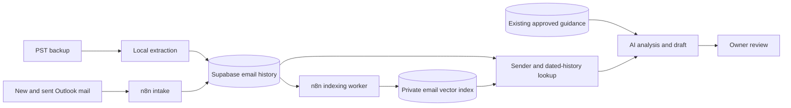

# Feeding the DCX email brain

The recommended process uses **Supabase as durable memory and n8n to keep it updated**. The initial PST export runs locally once, because a large archive should not travel through an email-trigger workflow. Your existing n8n workflow already searches the `documents` vector table through `knowledge_base`; preserve that corpus and its current behavior.

The brain needs three connected sources: exact correspondence, searchable historical passages, and approved business guidance. A vector index helps find passages; the original email is the evidence. This is retrieval, not model training.

## What each component owns

| Component | Responsibility |
| --- | --- |
| Local PST exporter | Read every mail item and preserve identities, dates, text and attachment references. No embedding or AI calls. |
| Supabase `crm_email_archive` | Imported correspondence with permanent source keys; separate from active reply queues. |
| Existing `email_messages`, `email_threads`, `email_attachments` | Ongoing mailbox records and tracked operational work. |
| Existing `crm_contacts`, `crm_customers` | Confirmed people and companies. Exact email matching; uncertain associations stay unlinked. |
| Proposed `crm_email_memory_chunks` | Customer-specific historical passages, embeddings and original-email references. Separate from general guidance. |
| Existing `documents` / `match_documents` | Preserve current support-guidance search. Do not bulk insert private customer history into this unfiltered corpus. |
| n8n | Indexing batches, new-mail intake, retries, retrieval before drafting, and change tracking. |
| AI | Interpret retrieved evidence and prepare an owner-reviewed reply. |

The current in-app implementation already has an exact-address/full-text memory lookup. Workflows 1 and 2 are now published with exact-address/full-text memory and confirmed reply examples; see `docs/workspace-email-rollout.md`. The semantic indexing worker remains a later phase.

## Phase 1 — Preserve and reconcile the backup

1. Export the PST locally using `scripts/extract-email-archive.mjs`, then run `automation/normalize_email_archive.py` to derive readable text from HTML-only messages without embedded styles/scripts. Keep full original plain-text bodies; retain original HTML when no plain body exists. Preserve quoted history in the evidence, even if later indexing uses a cleaner derivative.
2. Retain sender name/address, To/CC/BCC recipients, message and reply IDs, conversation ID, sent/received date, folder, and attachment metadata. Preserve drafts locally but exclude them from recall. Keep folder provenance so junk/deleted records can be excluded from normal retrieval after classification.
   Recover missing sender SMTP identities using `scripts/enrich-email-archive.mjs` from explicitly stored From headers or representing-address properties. Then use `scripts/resolve-archive-addresses.mjs` for unique, explicit links between stored legacy Exchange addresses and SMTP properties elsewhere in the archive. Ambiguous links are excluded. Do not guess an address from a name. Remaining unresolved identities stay flagged.
3. Count every mail item, export error, unresolved address and empty body. Reconcile exported IDs against inventory. Do not equate an earlier sample count with a complete export.
4. Apply the new Supabase migration, dry-run the importer, then import in small repeatable batches. Imported history must not trigger drafts, notifications, follow-ups or sends.
5. Generate a duplicate/reconciliation report using Internet Message ID and content checks. Keep PST/provider source references even when two records represent the same email. Never deduplicate solely by subject; repeated subjects can be separate jobs.

**Acceptance:** inventory/export counts reconcile; every failed item is listed; repeated imports create no duplicate source records; existing live drafts and queues retain their previous state.

## Phase 2 — Confirm identity and customer association

Recognize a person by their normalized email address. Keep display names as observed labels rather than proof of identity. Reuse a confirmed `crm_contacts` association. If more than one company/contact matches an address, record ambiguity rather than selecting one automatically.

For unlinked addresses, produce a candidate-contact list with observed names, first/last exchange, and number of emails. The owner can confirm company associations later. Do not create a company merely from an email domain. Shared mailboxes remain shared identities; different addresses are not merged because signatures say the same name. A future alias table should record explicitly confirmed links and their evidence.

**Acceptance:** two people named Des remain separate; a known sender retrieves their history; an unconfirmed alternate address does not silently inherit someone else's records.

## Phase 3 — Build semantic memory through n8n

Create a dedicated background indexing workflow alongside the existing intake workflow:

`Schedule → claim pending batch → load original email → classify/exclude → clean derivative → split passages → embed → save chunks → mark job complete`

- Start with a small batch and measure text/token volume before processing the full archive. Do not embed attachments yet.
- Exclude drafts and junk/automatic notices from normal customer recall; preserve the originals. A deleted-folder classification alone is not proof an email is irrelevant.
- Remove repeated signatures and quoted copies **only from indexing text**. Keep useful new text, with a link to the unmodified source. When a quoted passage contains the only available earlier evidence, retain it and label it as quoted, not as a separately verified message.
- Split long messages into passages within the chosen model's input limits. Each passage needs the subject, date, direction and speaker context. Avoid concatenating different customers into one passage.
- Store `source_type` (`pst` or `tracked`), source record key, thread reference, participant addresses, confirmed contact/customer IDs where available, message date, chunk index, body hash, extraction version, embedding model/dimensions and indexing status.
- Choose and record one embedding model/dimension for this new index. Verify the existing model configuration; do not assume the n8n default matches the app. A model change creates a new index version or requires re-embedding.
- Make chunk/job identity deterministic from source key, content hash, cleaning version, embedding model and chunk index. Retry only failed work. Use leases and a unique job key so simultaneous runs cannot index the same version twice.
- Mark removed/superseded sources ineligible for retrieval; retain provenance and approved retention rules. Do not let obsolete chunks stay active after corrected text is indexed.

The proposed chunk table should be private, accessed through server credentials and a dedicated retrieval function. Customer/address filters must apply **inside the database similarity query, before ranking and limiting**. Supabase documents why filtering only after an RPC can discard already-ranked results. [Supabase semantic-search documentation](https://supabase.com/docs/guides/ai/semantic-search).

**Acceptance:** every chunk opens an identifiable original email; repeated indexing adds no duplicate chunks; failed batches can resume; other customers' chunks cannot enter a sender-scoped result.

## Phase 4 — Add memory to existing incoming-mail drafting

Extend root **workflow 1**, retaining its current persistence and draft-review boundaries:

`Outlook email → normalize/store once → identify sender → load current thread/CRM → retrieve sender history → retrieve approved guidance → draft with source IDs → save for owner review`

1. Persist the incoming email before drafting. Start an indexing job independently; do not delay a new reply waiting for its embedding.
2. Load exact-address contact/customer matches and recent exchanges.
3. Search older correspondence using both topic similarity and keyword/date cues. If the email says “six months ago,” derive a date window relative to this email's timestamp and prioritize that period. If the date is ambiguous, label the assumption.
4. Expand selected matches with neighboring messages from their original thread so the AI sees the request, the reply and any correction. Respect evidence/token limits and mark incomplete chains.
5. Search general approved guidance separately. Customer history may establish what was requested or promised then; it does not establish a universal company policy or today's prices.
6. Give the model the current ask, identity confidence, dated history, approved guidance and attachment-read statuses as distinct inputs. Every material historical assertion should have a source reference.
7. Save the draft's retrieved source IDs and model/prompt/index versions so the owner can audit why it was suggested.

The existing n8n Supabase Vector Store supports insertion and retrieval with metadata filtering, but the deployed node/version and database function need a controlled test. Prefer a dedicated address-scoped RPC for private correspondence rather than trusting the model to select an optional filter. [n8n vector-store documentation](https://github.com/n8n-io/n8n-docs/blob/main/docs/integrations/builtin/cluster-nodes/root-nodes/n8n-nodes-langchain.vectorstoresupabase.md).

**Example:** Des sends “We discussed replacing the batteries about six months ago.” Match the sender's address, search that person's dated history, retrieve the original request and subsequent response, then draft from those records. If evidence is missing, report that it wasn't found; do not invent the previous agreement.

**Acceptance:** the draft correctly recalls an older request, distinguishes it from completed work, respects a later correction, and does not disclose another customer's information. Repeat the test for a same-name different sender and for a new sender with no history.

## Phase 5 — Keep the brain current

Use the existing incoming workflow plus a scheduled reconciliation of Sent Items. Replies from the owner are important evidence; incoming mail alone cannot show what was agreed. Reuse message IDs/delta checkpoints for duplicate control. Record edits, failures and source versions; expose indexing totals and failed jobs internally.

For the pilot, update memory for new and sent messages and run a periodic reconciliation for missed events. Set actual frequency based on the existing trigger behavior and measured load. Do not re-embed the full archive on every run. Summaries, if later introduced, must link to source emails and be refreshed after new evidence; they are secondary to originals.

**Acceptance:** a new reply becomes retrievable; replayed intake produces one operational message; unavailable memory produces an explicit status rather than a claim of recall.

## Phase 6 — Attachments when ready

The export already preserves attachment references. Later:

`email/file reference → private Storage upload → record storage path/hash → extract supported text → create file chunks → link to parent email/contact → retrieve when relevant`

Use the existing private storage bucket and `email_attachments` relationship for live mail. For archived messages, retain the PST descriptor ID and attachment index/number so the bytes can be recovered locally. Store permanent private storage paths; generate short-lived download links on demand. Unsupported/scanned/failed files require explicit extraction status. A filename alone never means the AI read the contents.

## Release order

1. Complete and verify local export.
2. Apply migration and import exact history.
3. Verify the in-app history lookup with a controlled returning sender.
4. Implement and evaluate the separate n8n indexing worker on a small historical batch.
5. Index the remaining eligible history and add sender-scoped semantic retrieval to workflow 1.
6. Verify new inbound and sent-mail updates end to end.
7. Add file ingestion separately when requested.

Keep owner review for replies. Email history can support a factual answer; it cannot itself verify current inventory, authorize a commitment, or prove a service issue was resolved.

## Implementation status — 4 October 2026

- Exported and reconciled **8,145** stored email records, including **210** drafts. No extraction errors. Virtual search folders are views and are excluded from stored-item totals.
- Retained **34,598** attachment references; no attachment contents extracted or uploaded.
- Generated a private directory of **1,060** observed participant email addresses and a local searchable history index. These are observed addresses, not confirmed individual customers.
- Recovered **2,330** missing sender addresses using explicit headers/properties and unique legacy-address links. **171** records still lack a verified sender address; one ambiguous legacy mapping was excluded. **30** records have empty readable bodies.
- Local search verified **4,264** non-draft emails older than six months and **1,574** older matches for a battery search. This checks retrieval, not the accuracy of an AI-generated answer.
- All three October Supabase migrations were applied through the existing n8n Postgres connection. **All 8,145 records were imported live** and an exact-address retrieval was verified. Historical import does not create inbox jobs or send mail.
- App tests passed **74/74**, the production build passed and selected browser checks passed **8/8**. The new dashboard/server release remains pending because Vercel CLI authentication is unavailable.
- Existing n8n drafting/review/send workflows were updated and published, and the supplier dispatcher was added and published. Its empty-queue live check passed without sending mail. Semantic indexing remains planned; no archive embeddings or live model-answer test were run.

Private output: `.tools/email-archive/messages.jsonl`, `contact_candidates.jsonl`, `history.sqlite`, `summary.json`. Setup and commands: `docs/email-memory-setup.md`.
