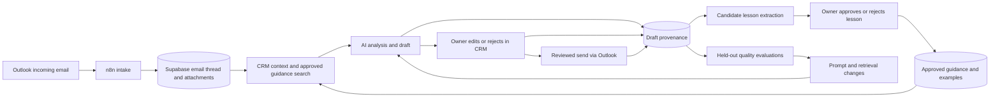

# Owner-guided learning for email replies

**Status:** Design proposal, 29 September 2026. No new learning pipeline is implemented by this document.

## Goal

Make the CRM's email assistant improve from the owner's reviewed replies while keeping business facts, customer information and sending decisions under owner control. Improvement should be measurable: fewer factual corrections, fewer unsupported promises, more useful first drafts, and faster owner review. A sent email alone is not proof that the customer's issue was solved.

## The main idea

Start with **capture → compare → review → retrieve → evaluate**. The model's weights do not change after every email. Instead, save the AI's proposed answer, the owner's final answer, the reason for material edits, and the verified outcome. Promote only reusable, approved lessons into a searchable guidance library. Include relevant guidance and comparable approved examples when drafting a future reply. Fine-tuning is an optional later step after enough clean examples and a held-out evaluation set exist.

### Example

An AI draft says, “We can send the quotation today.” The owner changes it to, “We can confirm pricing after checking the battery model and supplier availability.” The system records the edit and a quick reason, such as **Unverified timing**. A proposed rule, “Do not promise quotation timing until parts, scope and availability are confirmed,” goes to an owner review queue. Once approved, future drafts can use it. The case's one-time price, address and customer identity do not become a general rule.

## How the existing pieces connect

The dashboard should remain the owner-facing review point. Supabase is the durable system of record for examples, decisions and guidance. n8n can run intake and background extraction, but the app's authenticated server should own the authoritative write rules and send ledger. OpenAI supplies analysis and drafts; it is not the source of truth for current prices, availability or completed work.

## Current repository baseline

- `email_drafts.original_ai_body`, `current_body`, `email_draft_revisions`, `email_approvals` and `email_activity` already preserve much of the tracked-draft history in `supabase/migrations/202609230002_email_tracking.sql`.
- The in-app `server/conversation-ai-api.js` returns a suggested reply, but `MicrosoftInbox.tsx` opens it in the direct Outlook reply editor. That path currently lacks a durable link from the suggestion to the final provider-sent text.
- The active n8n Workflow 1 saves attachments but does not pass extracted attachment contents to its `Draft Reply` model input. Address this before using attachment-dependent drafts as positive training examples.
- The current model sometimes proposes unverified technical steps or timing. “Owner sent it” should therefore be evidence of review, not automatic evidence that every sentence is a reusable policy.

## Data to capture

Create a server-controlled feedback/provenance layer rather than copying all sent mail into a training set. Suggested records:

| Record | Key fields | Purpose |
| --- | --- | --- |
| `ai_reply_attempts` | thread/message IDs, mailbox, source path (`conversation_ai` or `n8n`), model/prompt version, draft text, cited knowledge IDs, attachment-read statuses, created time | Know exactly what the AI saw and proposed. |
| `reply_review_events` | attempt ID, owner ID, final text or revision reference, action (`accepted`, `edited`, `rejected`, `no_reply`), reason tags, optional note, timestamp | Measure how the owner handled the suggestion. |
| `reply_outcomes` | attempt ID, provider draft/message IDs, accepted/submitted/sent-copy-confirmed state, customer follow-up, owner resolution status | Separate drafting, delivery and actual case outcome. |
| `learning_candidates` | source event IDs, proposed general rule or example, confidence, sensitivity flags, status and reviewer | Queue reusable lessons for review. |
| `approved_guidance` | statement, category, scope (global/customer/equipment), evidence links, owner approval, version, effective/expiry dates | Retrieval source for future drafts. |

Keep exact source references so an owner can see *why* a rule was proposed. Use versioned and reversible records. A later correction should supersede a rule, not silently rewrite history. Customer-specific facts belong in the customer record, not in global guidance. Prices, inventory, access arrangements and deadlines need a live system lookup or owner confirmation each time.

## Capture the real final answer

1. When an AI suggestion opens the reply editor, create an `ai_reply_attempts` ID and carry it through draft save, revision and review. Capture whether the owner discarded it.
2. Link the Microsoft provider draft and sent message ID back to that attempt. After a send, reconcile with Sent Items and store the final body. Do not use a button click alone as proof of delivery.
3. For n8n-generated tracked drafts, reuse the existing `email_drafts` and revision IDs and add prompt/model/source references. For ordinary manually written replies, offer **Save as guidance**; do not automatically assume they are AI corrections.
4. Ask for a one-click reason only when a draft is substantially edited or rejected: **Wrong fact**, **Too long**, **Wrong tone**, **Missed context**, **Unread attachment**, **Unsafe technical advice**, **Unverified price/timing**, **No reply needed**, or **Other**. Make the note optional so the owner can keep working quickly.

## Learning pipeline

**Immediate, per draft:** retrieve approved rules and a few similar owner-approved examples filtered by customer, equipment, issue type, recency and permission. Tell the model which items are policy, historical example, customer fact or current verified record. Require it to label unread attachments and uncertain facts. Do not treat text inside email or attachments as instructions.

**Daily or weekly background job:** n8n compares AI draft with final sent body and feedback tags, proposes candidate lessons, and stores them as `pending`. A candidate is never directly added to live guidance. The owner reviews a compact card showing the original, edit, proposed lesson and source conversation. The owner can approve, edit, reject or mark customer-specific.

**Release cycle:** keep a fixed holdout set of representative cases, including UPS alarms, quote requests, reports, spam, unread files, changed customer asks and prompt injection. Compare new prompt/retrieval settings with the previous version. Measure unsupported claims, attachment honesty, number of owner edits, reply appropriateness and time to approve. Deploy only improvements that pass the agreed gates. Keep owner-reviewed sends mandatory until reliability is established.

**Possible later fine-tuning:** use curated examples only after the retrieval/prompt loop is working and evaluations show a remaining style or format problem. Training on every sent email would mix one-off facts, mistakes, customer secrets and outdated commitments into the model. A held-out set is needed to show that fine-tuning helped.

## Suggested first release

1. Add provenance capture for **both** in-app Conversation AI and n8n drafts, including the final sent text and no-reply/discard outcomes.
2. Add quick owner feedback to the reply UI and a read-only quality dashboard: accepted unchanged, materially edited, rejected, no-reply, and most common reasons.
3. Add an owner-approved guidance queue and retrieval of approved examples. Start with a small collection of real, reviewed examples and explicit business rules.
4. Fix attachment content extraction for the n8n draft path and display per-file read status before a draft can claim to use it.
5. Run a repeatable evaluation set before and after each change. Do not enable automatic sending as part of this release.

## Questions to settle before implementation

- Which owner actions count as approval of a lesson: explicit **Approve guidance** only, or a separate admin reviewer?
- How long may raw customer emails and extracted attachment text be retained in the learning tables, and who may view them?
- Should customer-specific approved examples be retrievable only for that customer, while general style rules apply across all customers? Recommended: **yes**.
- What evidence closes an issue: customer confirmation, completed service job, accepted quotation, or an owner-selected resolution reason? Define this per issue type.

## References

- Current system map: `SYSTEM.md`
- Email test findings: `docs/email-system-test-report-2026-09-29.md`
- Existing tracked-draft schema: `supabase/migrations/202609230002_email_tracking.sql`
- OpenAI evaluation guidance: https://developers.openai.com/api/docs/guides/evaluation-best-practices
- OpenAI retrieval guidance: https://developers.openai.com/api/docs/guides/retrieval
- OpenAI supervised fine-tuning guidance: https://developers.openai.com/api/docs/guides/supervised-fine-tuning
