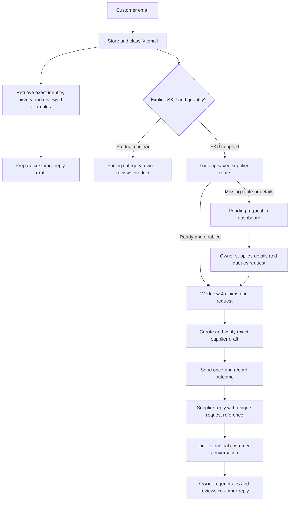

# Email brain and dashboard controls — October 4, 2026

Dashboard/server changes are implemented and tested locally. All three October migrations were applied to the configured live Supabase database, all **8,145** archive records were imported, and workflows 1–4 were published in the existing n8n instance. The dashboard/server release is still pending: the Vercel CLI is logged out and this workspace has no linked Vercel project. No test emails were sent.

## What changed

| Client request | Implementation |
| --- | --- |
| Remember previous conversations | Exact sender lookup and dated full-text history from `crm_email_archive` plus ongoing `email_messages`; workflow 1 and workflow 2 now call `crm_ai_context`. |
| Client learning | Confirmed sent AI replies record the original draft and final reviewed body for that exact correspondent. Later drafts retrieve up to five examples. Dashboard controls can exclude examples. This is retrieval, not model training. |
| Classify people | Staff, customers, qualified companies, leads, suppliers and others. Exact `dcx-tech.com` sender domain wins over editable classifications. Saved CRM relationships and explicit supplier routes inform identity. Names alone never link accounts. |
| Classify emails | Pricing, quotations, orders, service, technical, billing, meetings and other. Initial keyword rules classify existing and new tracked mail. Owner overrides remain fixed. Dashboard counts cover all tracked conversations; its list shows 200 recent conversations. |
| Supplier price automation | Save an exact product SKU, supplier email and whether automatic requests are allowed. Explicit SKU/quantity pricing emails create requests automatically. Missing mappings/details remain pending. Review and queue controls resolve pending requests. Workflow 4 dispatches requests. |
| Supplier response | An exact supplier sender plus the request's unique subject reference links the reply. The customer conversation needs attention, and regeneration receives the supplier's reply as evidence. Supplier cost is not automatically treated as the customer selling price. |
| AI drafts visible in Inbox | A saved AI reply appears above the conversation, with review/edit and delete controls. Matching uses the original email's Internet Message-ID. |
| Delete / restore drafts | AI drafts have recoverable trash without deleting the conversation. Deleted → Deleted AI drafts → Move to AI Draft Replies restores one. Outlook drafts have delete and folder move controls, including restoring to Drafts. |
| Hide AI analysis | Conversation AI analysis panel is hidden; saved AI replies remain visible. |
| Delete customers | Customers move to Deleted customers and can be restored. Contacts, history and saved quotations remain retained. |
| More pricing agreements | Save the current worksheet under a new name; delete unassigned agreements while retaining version history and quotation snapshots. Keep at least one agreement. |
| Editable quotation tax | Defaults to 13%; editable beside totals, saved and used by PDF export. |
| Quotation trash | Delete moves to Trash. Restore preserves the estimate number. Permanent deletion is an explicit action available only in Trash. |

## Live rollout and remaining deployment

Completed on 4 October 2026 using the existing n8n Postgres credential:

- Applied `202610040001_email_memory.sql`, `202610040002_workspace_controls.sql` and `202610040003_email_relationships_learning.sql` (n8n maintenance executions 167 and 168).
- Imported **8,145** source records, with **8,135** distinct Internet Message-IDs. Repeat imports resume by source key and preserve attachment links.
- Published workflow 1 `lrktCABRGu93BBXD`, workflow 2 `rWKsBzLw1BCjXugn`, workflow 3 `ia38UVye6S2PhzEp` and supplier workflow 4 `JqEMxisIQXBA1E3G`. Workflow 4 is in the DCX personal project, at the project root. Existing mailbox, credentials and workflow 2 webhook authentication were retained.
- Verified archive counts and exact-address history through live PostgreSQL (execution 170). Workflow 4's manual execution 169 completed with `claimed: false`; it did not create or send an email. There were zero supplier routes and requests at verification.
- The three drafts previously marked `sending` retained that status. They require reconciliation with Sent; this rollout did not reset or retry them.
- The unpublished maintenance workflow `uMTWd2tLMbmt9Kj2` now contains only a read-only verification query, replacing its migration operation.

Remaining release steps:

1. Deploy the dashboard and server code together to the existing hosting project. Vercel CLI authentication/project linkage is unavailable in this session. The live database and n8n work is complete; new UI controls will appear after the application deployment.
2. Save the client's real product SKU → supplier email mappings in Dashboard → Supplier price automation after deployment. Enable automatic requests per route only where desired, or review and queue individual requests. The dispatcher is published but has no work without these mappings and queued requests.
3. Verify the first new intake → draft → owner review → confirmed send in the connected mailbox. No model answer or delivery test was performed against a real recipient during this rollout.

Root workflow exports are synchronized to the published graphs, with `active: false` for safe future imports. Importing them again is unnecessary for this rollout. They retain the existing connected account configuration; changing the account requires its own mailbox configuration and OAuth connection.

n8n validation retained two pre-existing warnings: workflow 1's model configuration reports that `builtInTools` requires the Responses API setting, and workflow 3 exceeds the suggested canvas item count. Existing model configuration was preserved; a live generated-answer test is still needed. New supplier nodes and their graph validated without warnings.

## How a pricing request works

Automatic product recognition currently requires an explicit `SKU: BAT-01` token and `Qty: 4` or `Quantity: 4`. Freeform descriptions are shown as pricing conversations for review; the system does not guess a supplier. Multiple products need clear SKU and quantity confirmation; use the dashboard request control for ambiguous emails.

Supplier requests contain only product, quantity and the unique reference, rather than forwarding customer correspondence. Dispatch claims persist before sending. Interrupted or timed-out sends become `uncertain`, with no automatic resend. Check Sent and the stored draft ID before taking any further action. Supplier replies inform the customer draft; they never directly send a quotation to the customer.

The Outlook draft create/send fields follow the [n8n Outlook node source](https://github.com/n8n-io/n8n/blob/master/packages/nodes-base/nodes/Microsoft/Outlook/v2/actions/draft/create.operation.ts) and Microsoft's [draft message API](https://learn.microsoft.com/en-us/graph/api/user-post-messages).

## Verification

Local automated checks cover migration execution, quotation tax/trash/restore/purge, retained customer history, exact-domain classification, supplier request deduplication and single claims, sender-checked supplier replies, draft restoration and private learning examples. Browser checks cover tax totals, customer delete/restore, named agreements and inbox AI draft delete/restore. Local tests passed **74/74**, the production build passed, and **8/8** selected browser checks passed. Live PostgreSQL and n8n activation were verified as described above; recipient delivery and a generated live model answer remain untested.

The general `documents` vector knowledge base remains separate from private customer history. Semantic indexing of the archive is a later phase in `docs/email-brain-feeding-plan.md`; this release already retrieves exact-address and full-text history without requiring archive embeddings.
